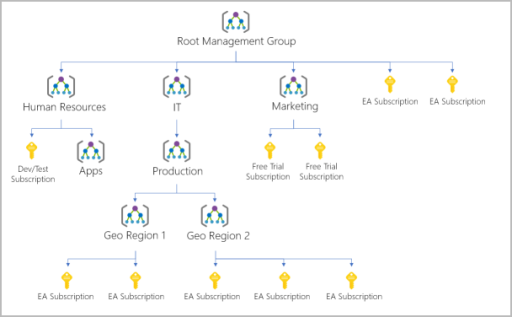
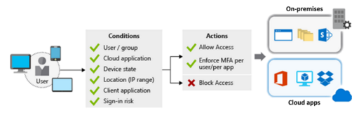
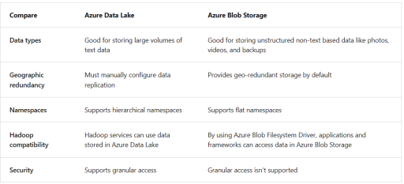
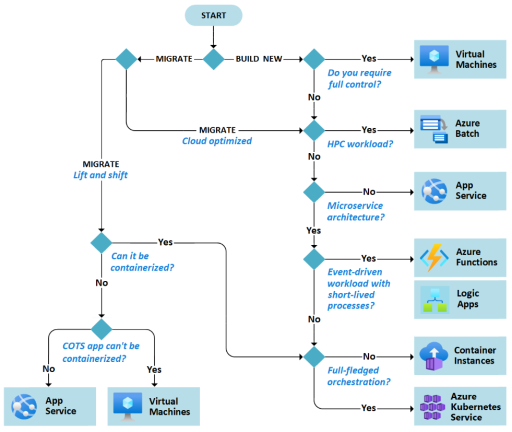
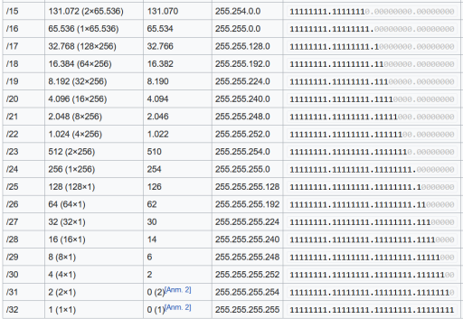
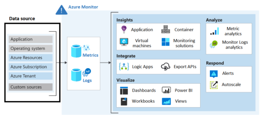

# Introduction

This is my own preparation material I created for the [AZ-305 exam](https://learn.microsoft.com/en-us/credentials/certifications/exams/az-305/). The content is primarily from two sources:

1. [Az305 learning path](https://learn.microsoft.com/en-us/credentials/certifications/exams/az-305/)
1. [Az305 Savill training video](https://www.youtube.com/watch?v=vq9LuCM4YP4)

I have quite a bit of working experience with Azure so I left out obvious things known to me with the goal to keep this compact (less than 30 pages when printed, skillcertpro cheat sheet has 252 pages) & readable without skipping any major topic.

# Fundamentals

Typical Azure hierarchy:

- **Management groups** help you manage access, policy, and compliance for multiple subscriptions.
- **Subscriptions** are logical containers that serve as units of management and scale. Subscriptions are also billing boundaries.
- **Resource groups** are logical containers into which Azure resources are deployed and managed.
- **Resources** are instances of services that you create. For example, virtual machines, storage, and SQL databases.

**Management Groups**:

- Limit the regions where virtual machines can be created, across subscriptions.
- Provide user access to multiple subscriptions by creating one role assignment that's inherited by other subscriptions.
- Monitor and audit role and policy assignments, across subscriptions.
- A management group tree can support up to [six levels of depth](https://learn.microsoft.com/en-us/azure/governance/management-groups/overview "https://learn.microsoft.com/en-us/azure/governance/management-groups/overview"). This limit doesn't include the tenant root level or the subscription level.
- Azure role-based access control authorization for management group operations isn't enabled by default.
- By default, all new subscriptions are placed under the root management group.
- 10,000 management groups can be supported in a single directory.
- Each management group and subscription can support only one parent.
- Can only have subscriptions that are located in same region
- Enables definition of Blueprints

**Subscriptions**:

- Subscriptions can provide separate billing environments, such as development, test, and production.
- Policies for individual subscriptions can help satisfy different compliance standards.
- You can organize specialized workloads to scale beyond the limits of an existing subscription.
- By using subscriptions, you can manage and track costs for your organizational structure.
- Boundary for things (e.g. Virtual Network), examples: Separation of duties, dev/test versus generic nonproduction, Different customers, Different departments or business units, Different projects

**Resource Groups**:

- Place resources of similar usage, type, or location in logical groups. (resources of the group can be used in different locations though)
- Organize resources by life cycle so all the resources can be created or deleted at the same time.
- Apply role permissions to a group of resources or give a group access to administer a group of resources.
- Use resource locks to protect individual resources from deletion or change.
- Common lifecycle (Create, Delete, Runtime)
- metadata of the RG is stored in region but resources can be in other regions
- A resource can only be in one group at a time

**Azure Landing Zones**:

- Landing zones are defined by management groups and subscriptions that are designed to scale according to business needs and priorities.
- Azure policies are associated with landing zones to ensure continued compliance with the organization platform.
- Landing zones are pre-provisioned through code.

**Region pairs**: Most Azure regions are paired with another region within the same geography (such as US, Europe, or Asia) at least 300 miles away (e.g., West US and East US). Paired region for services are read-only by default.

# Controls

Policy: What can you do (Guardrails)
RBAC: Who can do it (Identity, Scope, Roles/Actions)
Budget: How much

RBAC can be set on resource group level. Policies shall be set on Management group level to make sure these are applied for new subscriptions.

Azure Policy is a service in Azure that enables you to create, assign, and manage policies to control or audit your resources. These policies enforce different rules over your resource configurations so the configurations stay compliant with corporate standards.

Azure Policy "Modify" is used to add, update, or remove properties or tags on a subscription or resource during creation or update. A common example is updating tags on resources. Existing non-compliant resources can be remediated with a remediation task. A single Modify rule can have any number of operations. Policy assignments with effect set as Modify require a managed identity to do remediation.

Initiatives can group multiple policies together.

Things that can be done with RBAC:

- Allow one user to manage virtual machines in a subscription, and allow another user to manage virtual networks.
- Allow members of a database administrator group to manage SQL databases in a subscription.
- Allow a user to manage all resources in a resource group, such as virtual machines, websites, and subnets.
- Allow an application to access all resources in a resource group.

Roles can have Actions (Create, Read, ...) and DataActions (e.g. read Blob)

Azure Blueprints s a service designed to define a repeatable set of Azure resources that implements and adheres to an organization's standards, patterns, and requirements. It supports Resource Groups, ARM templates, RBAC assignments, Policy assignments. Can be used to deploy Landing Zones, applied on Management Group level, aissigned to subscriptions and define resource groups. Primary purpose is to enforce organizational standards from top level to individual resources.

# Identity

Zero Trust:

Distinction: Entra ID does LDAP, Kerberos etc. whereas Azure AD rather does OAuth, OpenID, SAML etc.

Microsoft Entra ID provides services such as:

- **Authentication**: This includes verifying identity to access applications and resources. It also includes providing functionality such as self-service password reset, multifactor authentication, a custom list of banned passwords, and smart lockout services.
- **Single sign-on**: Single sign-on (SSO) enables you to remember only one username and one password to access multiple applications. A single identity is tied to a user, which simplifies the security model. As users change roles or leave an organization, access modifications are tied to that identity, which greatly reduces the effort needed to change or disable accounts.
- **Application management**: You can manage your cloud and on-premises apps by using Microsoft Entra ID. Features like Application Proxy, SaaS apps, the My Apps portal, and single sign-on provide a better user experience.
- **Device management**: Along with accounts for individual people, Microsoft Entra ID supports the registration of devices. Registration enables devices to be managed through tools like Microsoft Intune. It also allows for device-based Conditional Access policies to restrict access attempts to only those coming from known devices, regardless of the requesting user account.

When you connect Active Directory with Microsoft Entra ID, Microsoft can help protect you by detecting suspicious sign-in attempts at no extra cost. For example, Microsoft Entra ID can detect sign-in attempts from unexpected locations or unknown devices.

Microsoft Entra Domain Services is a service that provides managed domain services such as domain join, group policy, lightweight directory access protocol (LDAP), and Kerberos/NTLM authentication. With Microsoft Entra Domain Services, you get the benefit of domain services without the need to deploy, manage, and patch domain controllers (DCs) in the cloud.

With External Identities, external users can "bring their own identities." Whether they have a corporate or government-issued digital identity, or an unmanaged social identity like Google or Facebook, they can use their own credentials to sign in. The external user’s identity provider manages their identity, and you manage access to your apps with Microsoft Entra ID or Azure AD B2C to keep your resources protected. 

Azure Entitlement Management enables users from other AD tenant to access yours.

SSO without IdP can be done via Password-based SSO (enables you to manage user access and passwords to web applications that don't support identity federation).

Application Proxy allows on-premises applications to use tokens from Microsoft Entra ID.

**Entra B2B**:

- With Microsoft Entra B2B, the external partner uses their own identity management solution. Microsoft Entra ID isn't required.
- No need to manage the external accounts or passwords.
- No need to sync the external accounts or manage the account lifecycles.
- External users use their identities to collaborate with our organization. The identities are managed by the partner themselves, or by another external identity provider on their behalf.
- Guest users sign in to our apps and services with their own work, school, or social identities.

[Azure AD B2C](https://learn.microsoft.com/en-us/azure/active-directory-b2c/overview "https://learn.microsoft.com/en-us/azure/active-directory-b2c/overview") is a type of Microsoft Entra tenant for managing customer identities and their access to your apps. The Microsoft Entra tenant represents your organization. The Azure AD B2C tenant represents the identities for your customer apps:

- Azure AD B2C provides secure authentication for your customers by using their preferred identity providers.
- You can capture sign in, preference, and conversion data for your customers.
- Azure AD B2C stores custom attributes about customers so you can use the information in your apps.
- You can use branded registration and custom UI sign-in experiences.
- The B2C option lets you separate the organization account from the customer account.

Azure AD 2.0 supports both work and personal accounts (including Microsoft).

Azure AD Domain Services can create managed ID in virtual network e.g. based on LDAP.

Azure AD Connect enables SSO for onPremise network. By default every new AD tenant comes with initial domain name foo.onmicrosoft.com. This can't be chenged or deleted but the or name can be added to the list like joe@foo.com.

Azure AD ability to provision and managed group-based access and allowing Self-service password reset for cloud-based users are part of Basic pricing tier.

Azure Active Directory (Azure AD) Privileged Identity Management (PIM): advanced features like 

- time/approval-based role activation
- receive notifications when roles are activated
- just-in-time access to Azure resources
- access reviews

Conditional Access is a tool that Microsoft Entra ID uses to allow (or deny) access to resources based on identity signals. These signals include who the user is, where the user is, and what device the user is requesting access from.

So Conditional Access can use conditions user/group, application, device state, IP range, client application and sign-in risk. Conditional Access Policies can't operate time-based, e.g. to limit start/end time of access.

To use Conditional Access, you need a Microsoft Entra ID P1 or P2 license. If you have a Microsoft 365 Business Premium license, you also have access to Conditional Access features.

MFA Service Settings allow yout to define time intervals for re-authentication (e.g. every 14 days with device).

For Customers you should use Azure AD B2C instance so they can use their own Social accounts but can also create one,

Azure AD Free Tier already supports 

- authentication with pass-through auth
- password hash sync
- seamless SSO
- self-Service password change

Premium P1 adds things like 

- automatic addition / removal of users to certain groups in Azure AD based on specified criteria
- MFA

Identity Protection provides risk policy detection that includes any identified suspicious actions related to user accounts in the directory. Two risk policies are evaluated: user risk and sign-in risk.

- **User risk** represents the probability that a given identity or account is compromised. An example is when a user's valid credentials are leaked. User risks are calculated offline by using Microsoft's internal and external threat intelligence sources. (Leaked credentials, threat intelligence). Microsoft recommends "High" threshold for User risk policy.
- **Sign-in risk** represents the probability that a given sign-in (authentication request) isn't authorized by the identity owner. Sign-in risk can be calculated in real time or offline. (anonymous IP, atypical travel, malware-linked IP address, password spray). Microsoft recommends "Medium and above" threshold for Sign-in risk policy.

Summary:

| Feature/Service                                  | Azure AD B2C                             | Azure AD B2B                             | Azure AD Privileged Identity Management    | Azure AD Connect                         | Azure AD Identity Protection              | Azure Managed Identity                  |
|--------------------------------------------------|------------------------------------------|------------------------------------------|--------------------------------------------|------------------------------------------|------------------------------------------|-----------------------------------------|
| **Primary Use Case**                             | Consumer identity management             | Business partner collaboration           | Managing privileged accounts               | Syncing on-premises directories to Azure | Protecting against identity threats      | Simplified identity for Azure services  |
| **Target Audience**                             | Consumers using apps and services        | External business users and partners     | IT admins and privileged users             | IT admins managing hybrid identities     | IT security teams                        | Azure service applications               |
| **Key Features**                                | Custom user attributes, social login     | Access management for external users     | Just-in-time privileged access             | Directory synchronization, SSO           | Risk-based conditional access            | Automatic handling of credentials        |
| **Deployment Scenarios**                        | Consumer-facing applications             | Cross-organization collaboration         | High-security environments requiring dynamic access control | Hybrid identity environments             | Any Azure AD environment                 | Azure resource access without stored credentials |
| **Security & Compliance**                       | Strong authentication, customizable policies | Governance and lifecycle management     | Audit reports, access reviews               | Secure hybrid access                     | Vulnerability and anomalous sign-in detection | Managed by Azure, reduces attack surface |
| **Integration & Extensibility**                 | Integrates with social networks and other identity providers | Seamless integration with Azure AD      | Integrates with Azure AD roles and groups   | Works with existing on-premises infrastructure | Integrates with other Azure security services | Integrates with Azure services          |

Microsoft Entra access review is a planned review of the access needs, rights, and history of user access. (new employees, company leaves,employess switching teams). Conducting access reviews can be done by

- **Resource owners**: The business owners of a resource.
- **Delegates**: A group of individuals selected by the access reviews admin.
- **End user**: A user who self-attests to their need for continued access.

Access Reviews can be configured to run periodically and may even remove users from groups automatically in case they did not confirm the need to be in there.

Many resources allow managed identity using a system-assigned Service Principal, 1:1 relation so only for one resource. Applications can use managed identities to obtain Azure AD tokens without having to manage any credentials.

The service principal for an app can be considered an **instance** of an app. Service principals generally reference an app object. One app object can be referenced by multiple service principals across directories. There are three types of service principals that you can use for your organization:

- **Application**: An application service principal is a local representation, or app instance, of a global app object in a single tenant or directory. The service principal object defines what the app can do in the specific tenant, who can access the app, and what resources the app can access.
- **Managed identities** provide an identity for applications to use when connecting to resources that support Microsoft Entra authentication. Common terms:
  - **Client ID**: The unique ID that's linked to the app and service principal created when you provisioned the identity.
  - **Object ID**: The service principal object of the managed identity.
  - **Azure Instance Metadata Service**: The REST API that's enabled when Azure Resource Manager creates a VM. The endpoint is accessible only from within the VM.
- **Legacy**: A legacy service principal can have credentials, service principal names, reply URLs, and other properties that an authorized user can edit. A legacy service principal doesn't have an associated app registration.

UPN: User Principal Name, typically an email address

There are also User-assigned managed identities that can be assigned to multiple resources. Managed identities provide an identity for apps to use when connecting to resources that support Microsoft Entra authentication. Apps can use the managed identity to obtain Microsoft Entra tokens. A managed identity combines Microsoft Entra authentication and Azure role-based access control (RBAC). When you use managed identities, you don't need to rotate credentials or worry about expiring certifications.

There are two types of managed identities:

- **System-assigned**: Some Azure services allow you to enable a managed identity directly on a service instance. (Good for **single resource** or independent identitites)
- **User-assigned**: You can create a managed identity as a standalone Azure resource. Create a user-assigned managed identity and assign it to one or more instances of an Azure service. A user-assigned identity is managed separately from the resources that use it. (good for **multiple resources** with same identity or need pre-authorization)

User-assigned managed identities automate credential rotation and can be applied to multiple resources. Service principals depend on secrets that expire and do not have automatic credential rotation.

Summary:

| Feature/Service                   | Service Principal                       | Managed Identity (System-assigned)          | Managed Identity (User-assigned)      |
|-----------------------------------|-----------------------------------------|---------------------------------------------|---------------------------------------|
| **Lifecycle Management**          | Manually managed                        | Automatically tied to the Azure service     | Manually created and managed          |
| **Scope of Use**                  | Across Azure services                   | Tied to a specific Azure service instance   | Can be attached to multiple instances |
| **Key Management**                | Requires manual rotation of secrets     | Azure handles key/credential rotation       | Azure handles key/credential rotation |
| **Setup Complexity**              | Requires setup and management of secrets| Automatically managed by Azure, no secrets  | Automatically managed, no secrets     |
| **Use Case**                      | General purpose for automation and CI/CD| Ideal for services needing to authenticate  | Suited for flexible scenarios         |
| **Identity Management**           | Tied to an application in Azure AD      | Directly managed by Azure, no Azure AD app  | Managed by Azure, no Azure AD app     |
| **Portability**                   | Not tied to specific Azure resources    | Not portable, destroyed with the resource   | Portable across services              |

Best way to store secrets is Azure KeyVault (Secrets, Keys, Certificates). Azure Key Vault can manage secrets, (encryption) keys and certificates (TLS). Standard tier lets you encrypt your data with a software key. Premium tier offers hardware security module (HSM)-protected keys.

Key Vault Premium is fully managed and FIPS 140-2 Level 2. Key Vault Standard is not FIPS 140-2 Level 2.

In order for Resource Manager templates to access Azure Key Vault you need to enable the setting in the Advanced policy section for the Key Vault.

Disaster recovery for keys/secrets in KeyVault is only possible in the same subscription and Azure geography.

Data Protection for KeyVault:

- **Soft delete** is designed to prevent accidental deletion of your key vault and keys, secrets, and certificates stored inside key vault. Think of soft-delete like a recycle bin.
- **Purge protection** Purge protection is designed to prevent the deletion of your key vault, keys, secrets, and certificates by a malicious insider. Think of this as a recycle bin with a time based lock. You can recover items at any point during the configurable retention period.

Sync changes between OnPrem AD and Entra Azure instances via **Entra Connect** that basically syncs password hashes. It is designed to sync users and devices between Microsoft Entra ID based domains and AD DS domains.

# Data Solutions

Structured Data: Table with rows and columns,schema

Semi-structured data: Documents like JSON, XML, HTML

Unstructured: Documents, Media

Storage Account: represents a collection of settings like location, replication strategy, and subscription owner. Aspects to consider:

- location
- compliance
- cost sensitivity
- storage replication
- administrative overhead
- data sensitivity

Storage account name needs to be globally unique (since its part of the URL). Create Azure Storage accounts before deploying your app. Create containers in your application as needed.

The Azure Storage platform includes the following data services:

- **Azure Blobs**: A massively scalable object store for text and binary data. Also includes support for big data analytics through Data Lake Storage Gen2. Blob Types are Block, Page, Append.
- **Azure Files**: Managed file shares for cloud or on-premises deployments (usually SMB but also NFS 4.1 and NetApp files).
- **Azure Queues**: A messaging store for reliable messaging between application components.
- **Azure Disks**: Block-level storage volumes for Azure VMs.
- **Azure Tables:** NoSQL table option for structured, non-relational data.

Performance Comparison:

- Azure Blob Storage: Up to 20,000 IOPS, up to 15 GiB/s throughput
- Azure Files: Up to 100,000 IOPS, up to 10 GiB/s throughput, supports NFS and SMB but no interoperability
- Azure NetApp Files: Up to 460,000 IOPS, up to 4.5 GiB/s throughput for regular volumes, up to 10 GiB/s throughput for large volumes, concurrent support and interoperability between SMB and NFS

Blob Storage supports NFS 3.0/REST/Data Lake Storage Gen2 protocol but not SMB. Block Blob Storage is used to maximize data throughput and to minimize latency for read and write operations.

Blob Storage supports Blobs up to 5TB, Page Blobs up to 8TB, Append Blobs (e.g. for appending logs) up to 195GB.

Premium Block Storage: Recommended for applications with high transaction rates. Use Premium block blobs if you work with smaller objects or require consistently low storage latency.

Premium File Shares: if you require support for both Server Message Block (SMB) and NFS file shares.

Premium Page Blobs: Page blobs are ideal for storing index-based and sparse data structures, such as operating systems, data disks for virtual machines, and databases.

Block storage has Access Tiers (Hot, Cool, Archive=offline), always a balance between capacity and transactions

Data in the cool and cold access tiers can tolerate slightly lower availability, but still requires high durability, retrieval latency, and throughput characteristics similar to hot data. For cool and cold data, a lower availability service-level agreement (SLA) and higher access costs compared to hot data are acceptable trade-offs for lower storage costs.

Blob also enables Locking (Immutable for legal/time-based holds). Immutable storage in Azure supports WORM (Write once, read many) state. Two policies:

- [**Time-based retention policies**](https://learn.microsoft.com/en-us/azure/storage/blobs/immutable-time-based-retention-policy-overview "https://learn.microsoft.com/en-us/azure/storage/blobs/immutable-time-based-retention-policy-overview") let users set policies to store data for a specified interval. When a time-based retention policy is in place, objects can be created and read, but not modified or deleted. After the retention period has expired, objects can be deleted, but not overwritten. The Hot, Cool, and Archive access tiers support immutable storage by using time-retention policies.
- [**Legal hold policies**](https://learn.microsoft.com/en-us/azure/storage/blobs/immutable-legal-hold-overview "https://learn.microsoft.com/en-us/azure/storage/blobs/immutable-legal-hold-overview") store immutable data until the legal hold is explicitly cleared. When a legal hold is set, objects can be created and read, but not modified or deleted. Premium Blob Storage uses legal holds to support immutable storage.

Azure File Sync can replicate between online and offline file shares, also enables tiering (e.g. if capacity is 80% certain rules can be applied) and local caching of Azure Files on-premise. Azure File Sync enables you to centralize your organization's file shares in Azure Files, while keeping the flexibility, performance, and compatibility of an on-premises file server. You can also use Azure File Sync to cache Azure file shares on Windows Server computers for fast access close to where the data is accessed. You can use any protocol that's available on Windows Server to access your data locally, including SMB, NFS, and FTPS. 

Azure Files enables selecting between HDD and SSD storage. For storage tiers:

- **Premium**: File shares are backed by solid-state drives (SSDs) and provide consistent high performance and low latency. Used for the most intensive IO workloads. Suitable workloads include databases, web site hosting, and development environments. Can be used with both Server Message Block (SMB) and Network File System (NFS) protocols.
- **Transaction optimized**: Used for transaction heavy workloads that don't need the latency offered by premium file shares. File shares are offered on the standard storage hardware backed by hard disk drives (HDDs).
- **Hot access tier**: Storage optimized for general purpose file sharing scenarios such as team shares. Offered on standard storage hardware backed by HDDs.
- **Cool access tier**: Cost-efficient storage optimized for online archive storage scenarios. Offered on storage hardware backed by HDDs.

Azure NetApp Files is a fully managed file service in the cloud, powered by NetApp, with advanced management capabilities. Azure NetApp Files is suited for workloads that require random access and provides broad protocol support and data protection capabilities.

Account has a type (e.g. standard general purpose v2, Premium for performance/latency). General purpose already supports customer-managed keys for encryption, allowing you to maintain control over the encryption keys.

Premium does not enable Globally redundancy, Standard does (trade-off performance vs. redundancy).

Redundancy Options:

- Locally redundant storage (LRS) > LRS replicates your data three times within a single data center in the primary region. LRS provides at least 11 nines of durability (99.999999999%) of objects over a given year.
- Geo-redundant storage (GRS) > GRS copies your data synchronously three times within a single physical location in the primary region using LRS. It then copies your data asynchronously to a single physical location in the secondary region (the region pair) using LRS. GRS offers durability for Azure Storage data objects of at least 16 nines (99.99999999999999%) over a given year.
- Read-access geo-redundant storage (RA-GRS)
- Zone-redundant storage (ZRS) > ZRS replicates your Azure Storage data synchronously across three Azure availability zones in the primary region. ZRS offers durability for Azure Storage data objects of at least 12 nines (99.9999999999%) over a given year
- Geo-zone-redundant storage (GZRS) > Data in a GZRS storage account is copied across three Azure availability zones in the primary region (similar to ZRS) and is also replicated to a secondary geographic region, using LRS, for protection from regional disasters. Microsoft recommends using GZRS for applications requiring maximum consistency, durability, and availability, excellent performance, and resilience for disaster recovery.GZRS is designed to provide at least 16 nines (99.99999999999999%) of durability of objects over a given year
- Read-access geo-zone-redundant storage (RA-GZRS) > mixture

For read access to the secondary region, enable read-access geo-redundant storage (RA-GRS) or read-access geo-zone-redundant storage (RA-GZRS). RA-GRS is generally cheaper than RA-GZRS.

RA: Read access only

The StorSimple Virtual Array is a good solution for having hybrid cloud storage where on-premise devices can connect to Azure using iSCSI. This also needs a Storage Account.

Managed Disk: Page Blob for VMs, AKS, can be HDD, SSD, Premium and Ultra SSD. A Premium managed disk affects SQL server performance positively, geo-redundant storage shall not be used.

Azure managed disk has max capacity of 32.767 GB.

Premium SSD enables me to set custom performance (bursting), disks can also be increased in capacity but not decreased

Managed Disk can be encrypted using Microsoft Managed Key or Disk Encryption Set (own key via KeyVault), OS can also be encrypton (Bitlocker Windows, dmcrypt Linux)

Three encryption options:

- [**Azure Disk Encryption (ADE)**](https://learn.microsoft.com/en-us/azure/virtual-machines/linux/disk-encryption-overview "https://learn.microsoft.com/en-us/azure/virtual-machines/linux/disk-encryption-overview") encrypts the VM's virtual hard disks (VHDs). If VHD is protected with ADE, the disk image is accessible only by the VM that owns the disk.
- **Server-Side Encryption (SSE)** is performed on the physical disks in the data center. If someone directly accesses the physical disk, the data will be encrypted. When the data is accessed from the disk, it's decrypted and loaded into memory. This form of encryption is also referred to as encryption at rest or Azure Storage encryption.
- **Encryption at host** ensures that data stored on the VM host is encrypted at rest and flows encrypted to the Storage service. Disks with encryption at host enabled aren't encrypted with SSE. Instead, the server hosting your VM provides the encryption for your data, and that encrypted data flows into Azure Storage.

Storage Account key access can be disabled, alternative would be Shared Access Signature (signed with Access key), another option RBAC data. A Shared access signature is a string that contains a security token that can be attached to a URI. Use a shared access signature to delegate access to storage objects and specify constraints, such as the permissions and the time range of access.

The default network rule is to allow all connections from all networks.

Azure Queue storage is a service for storing large numbers of messages. Once stored, you can access the messages from anywhere in the world via authenticated calls using HTTP or HTTPS. A queue can contain as many messages as your storage account has room for (potentially millions). Each individual message can be up to 64 KB in size. 

The Azure Import/Export service migrates large quantities of data between an on-premises location and an Azure storage account. By using the Import/Export service, you send and receive physical disks that contain your data between your on-premises location and an Azure datacenter. Import/export requires driveset and dataset CSV files.

Azure Data Box is a physical migration service that helps transfer large amounts of data in a quick, inexpensive, and reliable way. The secure data transfer is accelerated by shipping you a proprietary Data Box storage device that has a maximum usable storage capacity of 80 terabytes. Data Box is ideally suited for transferring data sizes larger than 40 TBs where there is also limited network bandwidth (e.g. 100MBps). Data Box is managed by Microsoft.

Azure Table storage stores large amounts of structured data. Azure tables are a NoSQL datastore that accepts authenticated calls from inside and outside the Azure cloud. This enables you to use Azure tables to build your hybrid or multi-cloud solution and have your data always available. Azure tables are ideal for storing structured, non-relational data.

## SQL & Analytics

Transactional databases are often called **online transaction processing (OLTP)** systems. OLTP systems commonly support many users, have quick response times, and handle large volumes of data. They also are highly available, which means they have minimal downtime. OLTP systems typically handle small transactions or relatively simple transactions. An example of an Azure service that supports OLTP is Azure SQL Database.

**Online analytical processing (OLAP)** systems commonly support fewer users, have longer response times, can be less available, and typically handle large transactions or complex transactions. An example of an Azure service that supports OLAP is Azure Analysis Services.

A hot data path is  typically used for processing or displaying data in real time (e.g. real-time alerting, streaming). A warm data path supports analyzing data as it flows through the system (recent subset of data for analytic processing). A cold data path can help to calculate utilization over some time period in the past and create/identify different pivots and aggregations (long term analytics).

Azure SQL DB:

- PaaS
- 100 TB size
- Autoscale enabled
- Supports active geo-replication across regions (both General Purpose and Premium)
- Supports autofailover groups
- Columnstore indexing supported in tiers S3 & Premium
- Service Tiers available: General purpose (1 node), Business Critical (several nodes), Hyperscale (Sharding with page servers)

Azure SQL Managed Instance

- PaaS in VNet, better compatibility, ideally for Lift & Shift migrations
- Supports autofailover groups (but not geo-replication in multiple regions or autoscaling)
- supports more features compared to Az SQL DB (e.g. CLR without file system access, Cross-database transactions), good for migrating onPremise workloads to VMs
- uses vCores mode, max CPU/Storage can be defined
- deploys own Virtual Network
- ideal for customers interested in instance-scoped features, such as SQL Server Agent, Common language runtime (CLR), Database Mail, Distributed transactions, and Machine Learning Services

Both SQL Database and SQL Managed Instance use SQL Server technology to create full backups every week, differential backups (=increments) every 12-24 hours, and transaction log backups (to restore transaction logs up to a specific time, which includes the moment before data was mistakenly deleted) every 5 to 10 minutes.

Pricing Options:

- **vCore**: A vCore is a virtual core. You choose the number of virtual cores and have greater control over your compute costs. This option supports the Azure Hybrid Benefit for SQL Server and reserved capacity (pay in advance). Generally recommended by Microsoft.
- **DTU**: A DTU (Database Transaction Unit) is a combined measure of compute, storage, and I/O resources. The DTU option is a simple, preconfigured purchase option. Simplifies predictability/fixed costs. This option isn't available for Azure SQL Managed Instance.
- **Serverless (part of vCore)**: A compute tier for single databases in SQL Database. The serverless model automatically scales compute, based on workload demand, and bills only for the amount of compute used. Good for unpredictable workloads.

vCore-based with serverless compute stops the database service when it is not in use. DTU-based and vCore-based with provisioned compute do not scale down automatically.

Azure SQL Database elastic pools are a simple, cost-effective solution for managing and scaling multiple databases that have varying and unpredictable usage demands.

Summary:

| Feature/Aspect                 | Elastic Pools                       | DTU Model                            | vCore Model                          | Serverless Model                        |
|--------------------------------|-------------------------------------|--------------------------------------|--------------------------------------|-----------------------------------------|
| **Resource Allocation**        | Shared resources across many databases | Fixed resources per database        | Fixed or scalable resources per database | Automatically scales compute resources  |
| **Cost Efficiency**            | Cost-effective for multiple databases with varying loads | Predictable, fixed cost           | More control over cost based on usage  | Costs based on actual compute usage     |
| **Performance Isolation**      | Resources are shared; less isolation | Dedicated resources provide isolation | High degree of isolation              | High degree of isolation                |
| **Scaling**                    | Manual or auto-scaling of DTUs/vCores for the pool | Scale up/down manually             | Scale up/down manually or autoscale  | Automatically scales; auto-pauses       |
| **Use Case**                   | Suitable for multiple databases with fluctuating loads | Best for single databases with stable performance needs | Best for demanding and high-performance workloads | Ideal for databases with intermittent, unpredictable workloads |
| **Hybrid Benefit**             | Applicable (if using vCore)         | Not applicable                      | Applicable                            | Applicable                               |

Geo-restore allows you to recover from a geographic disaster when you cannot access your database or backups in the primary region. It creates a new database on any existing server or managed instance, in any Azure region.

Azure SQL General Purpose tier supports zone-redundant configurations, which can maintain availability in the event of a single datacenter outage.

Azure uses Transparent data encryption (TDE) for Data at Rest. All new SQL DBs and Azure SQL Managed Instance after February 2019 have TDE enabled. TDE performs encryption and decryption of the data at the page level. The data is encrypted as the data is written to the data page on disk and decrypted when the data page is read into memory. Backups are also encrypted. DB Encryption keys can be Service- oder Customer-managed.

"Always Encrypted" is a new data encryption technology in Azure SQL Database and SQL Server that helps protect sensitive data at rest on the server, during movement between client and server, and while the data is in use.

Elastic database transactions for Azure SQL DB allow you to run transactions that span several databases in SQL DB.

By default, Azure SQL Database automatic backups remain available to restore for up to 35 days. With long-term retention (LTR) you can store Azure SQL Database backups in read-access geo-redundant storage (RA-GRS) blobs for up to 10 years.

The vCore-based purchasing model offers three service tiers:

- General Purpose: designed for common workloads. It offers budget-oriented balanced compute and storage options.
- Business Critical: designed for OLTP applications with high transaction rates and low latency I/O requirements. It offers the highest resilience to failures by using several isolated replicas.
- Hyperscale: designed for most business workloads. Hyperscale provides great flexibility and high performance with independently scalable compute and storage resources. It offers higher resilience to failures by allowing configuration of more than one isolated database replica.

The Hyperscale service tier is available only in Azure SQL Database. It uses a tiered layer of caches and page servers to expand the ability to quickly access database pages without having to access the data file directly. This tier uses snapshots, which allow for nearly instantaneous database backups, regardless of database size. Database restores take minutes rather than hours or days. Best option for large-scale on-premise database migration (up to 100TB).

DTU model offers Standard (Balanced Compute and Storage) and Premium (High transaction rates, low I/O requirements).

SLA Azure Database for MySQL is 99.99%. The Geo-redundant backup (GRB) feature in Azure Database for MySQL allows automatic backups to be stored in a different geographic region (geography). In the event of a region-wide service disruption, you can restore the database from the geo-redundant backup, which helps minimize downtime.

Azure PostgreSQL also offers a scale-out hyperscale solution called Citus. Citus provides both scale-out and additional high availability for a server group. 

Both Azure Database for MySQL and PostgreSQL supports the option for a read replica. This means a replica can be used for activities like reporting to offload work from the primary database. A read replica also enhances availability because it exists in another region.

Elastic Pool: Resource sharing between multiple databases for price optimization, simplified performance management for multiple databases

Two mechanisms for horizontal scaling using Elastic Database Client Library:

- **Sharding**: Partition data across a set of SQL databases that are identically structured. Also works across regions.
- **Read scale-out**: Offload read-only workloads by using the compute capacity of a read-only replica, instead of running workloads on the read-write replica. Only available in Business Critical, Premium and Hyperscale tiers.

Read Scale Out useful if there's both transactions (Read+write) and Analytics (read) performed on same data.

SQL Server in IaaS VM

- needs patching, backup > full responsibility
- may be needed for sophisticated features like SSIS (SQL Server Integration Services for data integration) which are not supported by Azure SQL DB and whre Managed Azure is not an option. SSIS can also be deployed as integration runtime to Data Factory. 

With SQL Server on Azure VMs in a single subnet, the distributed network name (DNN) routes traffic to the appropriate clustered resource. It provides an easier way to connect to an Always On availability group (AG) than the virtual network name (VNN) listener, without the need for an Azure Load Balancer.

DNN provides a unified namespace to access services within a clustered environment but does not depend on a static IP address. It is essentially a network name that is resolved by DNS services and is used to distribute requests across multiple instances, pods or nodes. VNN ties to one or more IP addresses but remains consistent regardless of which node in the cluster the SQL Server instance is running on. This stability ensures that even if there's a failover to another node, the network name used by client applications does not change.

SQL Server HADR (High Availability and disaster recovery) features:

- Always On Failover Cluster Instance (FCI): Instance level (install)
- Always On Availability Group (AG): Database level (install + data)
- Log Shipping: Database level (install + data), easy to administrate & deploy

**FCI failover** is full stop & start of the entire SQL instance (DB, settings, jobs, VM, ...). To ensure another node can access the database, FCIs require some form of shared storage (no data replication). For Windows Server-based architectures, this can be achieved via an Azure Premium File Share, iSCSI, Azure Shared Disk, Storage Spaces Direct (S2D), or a supported third-party solution like SIOS DataKeeper. Typically used within a datacenter. Until AGs were introduced, FCIs were the most popular way to implement SQL Server high availability.

**Always On Availability Group:** The biggest difference between an FCI and an AG is that AGs provide database-level protection. The primary replica is the instance participating in an AG that contains the read/write databases. A secondary replica is where the primary sends transactions over the log transport to keep it synchronized. Data movement between a primary replica can be synchronous or asynchronous. AGs can have a quicker failover time compared to an FCI, which is one reason they are attractive. Typically used for geo-redundancy. The storage is local to each replica. 

The **Log Shipping** mechanism is simple: first, take a full backup of the source database on the primary server, restore it in a loading state (STANDBY or NORECOVERY) on another instance known as a secondary server or warm standby. This new copy of the database is known as a secondary database. An automated process built into SQL Server will then automatically backup the primary database’s transaction log, copy the backup to the standby server, and finally, restore the backup onto the standby. Generally higher RTO and RPO compared to AGs.

Cluster mechanism is Windows Server Failover Cluster (WSFC) of Windows and Pacemaker (Linux). 

LTR (Long Term Retention) is required to store a backup for more than 35 days.

Azure SQL Edge

- IoT, basically Linux containerized version of SQL
- lightweight, less than 500MB startup memory footprint
- can be deployed connected (via Azure Marketplace as module for IoT Edge) or disconnected (Container image from dockerhub, standalone container or part of K8S cluster)

Tables: very simple key/value store

CosmosDB: more advanced solution, multi-region, different consistency models. CosmosDB API can be SQL, MongoDB, Cassandra, Table, Gremlin (Graph). Cosmos has single-digit millisecond response times and guaranteed speed at any scale (unique). Azure CosmosDB also support SQL commands and multi-master writes.

Azure CosmosDB Data Migration tool can also migrate (Microsoft) SQL database to CosmosDB.

Azure Data Factory: ETL data integration process to orchestrate data movement and transform data at scale, 90+ built-in data connectors helping to build pipelines. Four major steps for a data-driven workflow:

1. **Connect and collect**. First, ingest the data to collect all the data from different sources into a centralized location.
1. **Transform and enrich**. Next, transform the data by using a compute service like Azure Databricks and Azure HDInsight Hadoop.ricks and Azure HDInsight Hadoop.
1. **Provide continuous integration and delivery (CI/CD) and publish**. Support CI/CD by using GitHub and Azure DevOps to deliver the ETL process incrementally before publishing the data to the analytics engine.
1. **Monitor**. Finally, use the Azure portal to monitor the pipeline for scheduled activities and for any failures.

Azure Data Factory also supports hybrid scenarios (combining Cloud data with data from On-Premise systems) and SSIS.

Data Factory is usually used to run data integration pipelines but not for real-time analytics.

Pipelines provide a way to encapsulate one or more actions that can be applied to data as it is transferred from one data store to another. It enables you to transfer data from one store to another and apply transformations to the data at scheduled intervals.  Pipelines can be in Azure but also onPremise (feeds data into Data Factory).

Azure Data Lake Storage Gen2: supports HDFS, full hierarchy, POSIX. It stores any type of data by using the data's native format. It is optimized for unstructured data and provides geo-redundancy. Primarily designed for HDFS (Hadoop Distributed File System). Differentiation to Blob Storage:

Azure Stream Analytics is a fully managed (PaaS offering) data warehousing solution for real-time analytics and complex event-processing engine. It offers the possibility to perform real-time analytics on multiple streams of data from sources like IoT device data, sensors, clickstreams, and social media feeds. Supports data formats CSV, JSON, and Avro. As ingest Azure Event Hubs (including Azure Event Hubs from Apache Kafka), Azure IoT Hub, or Azure Blob Storage are supported. It is based on SQL to filter, sort, aggregate, and join streaming data over a period. For ultra-low latency analytics, run Stream Analytics on IoT Edge or Azure Stack.

Data security needs data classification (Azure Purview), data at rest (transparent data encryption), in transit, in use (dynamic data masking e.g. for last digits of credit card, always encrypting even on client side)

An ideal data store that can store large amounts of data with an integration with Power BI is the SQL Data Warehouse.

## Azure Databricks & Synapse

Azure Databricks is entirely based on Apache Spark with a ricks is entirely based on Apache Spark with a built-in core API for core languages like SQL, Java, Python, R, and Scala.

- **Control Plane**: Hosts Databricks jobs, notebooks with query results, and the cluster manager. The Control plane also has the web application, hive metastore, and security access control lists (ACLs), and user sessions. These components are managed by Microsoft in collaboration with Azure Databricks and don't reside within your Azure subscription. The Control plane also has the web application, hive metastore, and security access control lists (ACLs), and user sessions. These components are managed by Microsoft in collaboration with Azure ricks jobs, notebooks with query results, and the cluster manager. The Control plane also has the web application, hive metastore, and security access control lists (ACLs), and user sessions. These components are managed by Microsoft in collaboration with Azure Databricks and don't reside within your Azure subscription.
- **Data Plane**: Contains all the Azure Databricks runtime clusters that are hosted within the workspace. All data processing and storage exists within the client subscription. No data processing ever takes place within the Microsoft/Databricks-managed subscription.ricks runtime clusters that are hosted within the workspace. All data processing and storage exists within the client subscription. No data processing ever takes place within the Microsoft/ricks runtime clusters that are hosted within the workspace. All data processing and storage exists within the client subscription. No data processing ever takes place within the Microsoft/Databricks-managed subscription.

For development there are three environments: Databricks SQL, Databricks Data Science & Engineering and Databricks Machine Learning. Typical scenarios are recommendation engines, churn analysis, and intrusion detection.

Databricks Credentials passthrough allows users to authenticate with Azure Data Lake Storage using their own Azure AD credentials.

Databricks Premium SKU provides access control for DBFS root and FUSE mount points. This will ensure that the data engineers can only access folders to which they have permissions.

Azure Synapse supports data ingestion, exploration, transformation, and management, and supports analysis for all your BI and machine learning needs. Its architecture is based on a control node and multiple compute nodes. The control node is the brain of the architecture. It's the front end that interacts with all applications. The compute nodes provide the computational power. The data to be processed is distributed evenly across the nodes. Data is queried in the form of Transact-SQL statements, and Azure Synapse Analytics runs them. Azure Synapse uses a technology named [PolyBase](https://learn.microsoft.com/en-us/sql/relational-databases/polybase/polybase-guide? "https://learn.microsoft.com/en-us/sql/relational-databases/polybase/polybase-guide?") that enables you to retrieve and query data from relational and non-relational sources. You can save the data read in as SQL tables within the Azure Synapse service.

PolyBase enables your SQL Server instance to query data with T-SQL directly from SQL Server, Oracle, Teradata, MongoDB, Hadoop clusters, Cosmos DB, and S3-compatible object storage without separately installing client connection software. A key use case for data virtualization with the PolyBase feature is to allow the data to stay in its original location and format. 

Components of Azure Synapse:

- **Azure Synapse SQL pool**: Synapse SQL offers both serverless and dedicated resource models to work with a node-based architecture. For predictable performance and cost, you can create dedicated SQL pools. For irregular or unplanned workloads, you can use the always-available, serverless SQL endpoint.
- **Azure Synapse Spark pool**: This pool is a cluster of servers that run Apache Spark to process data. You write your data processing logic by using one of the four supported languages: Python, Scala, SQL, and C# (via .NET for Apache Spark). Apache Spark for Azure Synapse integrates Apache Spark (the open source big data engine used for data preparation, data engineering, ETL, and machine learning).
- **Azure Synapse Pipelines**: Azure Synapse Pipelines applies the capabilities of Azure Data Factory. Pipelines are the cloud-based ETL and data integration service that allows you to create data-driven workflows for orchestrating data movement and transforming data at scale. You can include activities that transform the data as it's transferred, or you can combine data from multiple sources together.
- **Azure Synapse Link**: This component allows you to connect to Azure Cosmos DB. You can use it to perform near real-time analytics over the operational data stored in an Azure Cosmos DB database. Also needed to enable connectivity to other sources (e.g. MongoDB).
- **Azure Synapse Studio**: This element is a web-based IDE that can be used centrally to work with all capabilities of Azure Synapse Analytics. You can use Azure Synapse Studio to create SQL and Spark pools, define and run pipelines, and configure links to external data sources.

Typical analytical scenarios are questions like "what now", "why", "what future" and "what action".

# Compute

Compute-optimized VMs (F*) for Medium traffic web servers, Network appliances, Batch processes, Application servers

Memory-optimized VMs (D*, E*) are great for relational database servers, medium to large caches, and in-memory analytics.

Storage-optimized VMs (L*) for VMs running databases

GPU-optimized VMs are N*.

Azure Batch: Managed service to run large-scale parallel and high-performance computing (HPC) applications. It is based on VMs and...

- starts a pool of compute virtual machines for you.
- installs applications and staging data.
- runs jobs with as many tasks as you have.
- identifies failures, requeues work, and scales down the pool as work completes.

Azure Container Instances are a fast and simple way to run a container on Azure. Scenarios for using Azure Container Instance include simple applications, task automation, and build jobs. A container group is a collection of containers that get scheduled on the same host machine. The containers in a container group share a lifecycle, resources, local network, and storage volumes.

The Azure Kubernetes Service (AKS) environment is enabled with many features, such as automated updates, self-healing, and easy scaling. AKS supports two auto cluster scaling options. The horizontal pod autoscaler watches the resource demand of pods and increases pods to meet demand. The cluster autoscaler component watches for pods that can't be scheduled because of node constraints. It automatically scales cluster nodes to deploy scheduled pods.

In AKS the Contributor role can change roles and bindings.

Azure Functions default timeout is 300 seconds (5 minutes) for Consumption Plan functions, and 30 minutes for any other plan. Azure Functions Premium tier has these features:

- perpetually warm instances to avoid any cold start
- VNet connectivity
- unlimited execution duration (60 minutes guaranteed)
- premium instance sizes (one core, two core, and four core instances)

You can use the AppService WebJobs feature to run a program (.exe, Java, PHP, Python, or Node.js) or script (.cmd, .bat, PowerShell, or Bash) in the same context as a web app, API app, or mobile app. They can be scheduled or run by a trigger. WebJobs are often used to run background tasks as part of your application logic.

Only AppService plans Premium V2 and Premium V3 are zone redundant. AppService Standard plan (S1) supports scaling up to 10 instances. AppService Free plans (D1, F1) don't have SSL Certificates.

Deployment slots provided by Azure web apps is the fastest method for swapping between deployed environments.

Azure CycleCloud Provides the simplest way to manage HPC workloads using any scheduler (like Slurm, Grid Engine, HPC Pack, HTCondor, LSF, PBS Pro, or Symphony) on Azure.

**Messaging**

Pub/Sub: If the sending component in your application expects communication to be processed in a specific way by the destination component, consider implementing messages. If the sender component in your application has no requirements for the destination component, you might implement events rather than messages. In a message-based communication, there's an expectation that both the message sender and receiver complete their tasks.

If messages shall be consumed by only one consumer use a (Service Bus) queue, not a topic. By default messages are deleted from the queue immediately after they were read.

General comparison

| Feature              | Service Bus                             | Event Grid                          | Event Hub                                  | Azure Queues                 |
|----------------------|-----------------------------------------|-------------------------------------|--------------------------------------------|------------------------------|
| **General Purpose**  | High-value enterprise messaging (complex integration problems, dead lettering, transactions)        | Highly scalable PubSub event routing with filtering        | High throughput event streaming targeting applications and IoT (telemetry and streaming)           | Simple queue messaging (lower costs)      |
| **Comm. Mechanism**  | Both push and pull                      | Push (event-driven)                 | Both push and pull (with consumer groups)  | Pull                         |
| **Protocols**        | AMQP, HTTP, REST                        | HTTP, HTTPS, WebHook                | AMQP, HTTP                                 | HTTP, HTTPS                  |
| **Message Sizes**    | Up to 1 MB (standard); 100 MB (premium) | Up to 64 KB (events)                | Up to 1 MB per event                       | Up to 64 KB per message      |
| **Limitations**      | Higher cost, complex setup              | Limited to event handling           | High throughput but limited message size   | Basic features, lower throughput |
| **Retention**        | Up to 14 days (duplicate detection)     | 24 hours (event delivery)           | Up to 7 days or longer with capture feature | Up to 7 days                 |
| **Queue Sizes**      | Up to 80 GB (premium)                   | N/A (not a queueing solution)       | Unlimited with retention policies          | Up to 500 TB (storage account limit) |
| **Message Processing**| FIFO, duplicate detection, sessions    | Event handling, filtering           | Stream processing with partitioning        | FIFO, poison message handling |

Azure Queue Storage: Simple queue, good for audit trails, queue storage can exceed 80 GB / millions of messages

Azure Service Bus is a fully managed enterprise message broker. It supports message queues (one receiver) and PubSub topics (multiple destinations):

- [Azure Service Bus message queues](https://learn.microsoft.com/en-us/azure/service-bus-messaging/service-bus-queues-topics-subscriptions#queues "https://learn.microsoft.com/en-us/azure/service-bus-messaging/service-bus-queues-topics-subscriptions#queues") is a message broker system built on top of a dedicated messaging infrastructure. Like Azure queues, Service Bus holds messages until the target is ready to receive them.
- [Azure Service Bus publish-subscribe topics](https://learn.microsoft.com/en-us/azure/service-bus-messaging/service-bus-queues-topics-subscriptions#topics-and-subscriptions "https://learn.microsoft.com/en-us/azure/service-bus-messaging/service-bus-queues-topics-subscriptions#topics-and-subscriptions") are like queues but can have multiple subscribers. When a message is sent to a topic, multiple components can be triggered to perform a task.

Azure Service Bus queues provide advanced message handing, and can group messages into a transaction. Service Bus uses a publication/subscription method for messages with polling.

To create a first-in, first-out (FIFO) guarantee in Service Bus use sessions.

To forward messages in Service Bus, use Autoforwarding. The autoforwarding feature chains a queue or subscription to another queue or topic.

Azure Event Hubs is a fully managed, big data streaming platform and event ingestion service. It implements a distinct **pull** mode:

- Event Hubs holds each message in its cache and allows it to be read.
- When a message is read from Event Hubs, it's not deleted. The message remains for other consumers.

It does not have a built-in mechanism to handle messages that aren't processed as expected. Messages have max. retention of 7 days.

Event Hub is focused on high throughput and streaming (telemetry, logging), Service Bus (like Kafka) more FIFO-oriented (queues, topics) with more complex routing & processing of messages.

Azure Event Grid is a fully managed event routing service that runs on Azure Service Fabric suitable for reactive programming. It aggregates all your events and provides routing from any source to any destination. It understands all kind of sources (Storage, IoT Hub, ML, Redis, ...) and registers handlers (Function, Storage Queue, Logic Apps, ...)

Logic Apps: Graphical Designer for event-based actions, no code, lots of templates and connectors, not ideal for real-time requirements, complex business rules, non-standard services.

Azure Queues: basic FIFO, Service Bus is more advanced with topics for multiple subscribers

Azure Cache for Redis provides an in-memory data store based on the Redis software. Redis improves the performance and scalability of an application that uses back-end data stores heavily. It's able to process large volumes of application requests by keeping frequently accessed data in the server memory, which can be written to and read from quickly. It is suitable for Data and Content caching, Session store, job and message queuing and distributed transactions.

Azure API Management is a cloud service platform that lets you publish, secure, maintain, and analyze all your APIs. Azure API Management can serve as a front door for an organization's APIs, and routes to the server where the APIs are deployed.

# Networking

Azure virtual network (VNet) allows you to create multiple isolated virtual networks. When you set up a virtual network, you define a private IP address space by using either public or private IP address ranges. The IP range only exists within the virtual network and isn't internet routable. For name resolution, you can use the name resolution service that's built into Azure. You also can configure the virtual network to use either an internal or an external DNS server. You can link virtual networks together by using virtual network peering. Peering allows two virtual networks to connect directly to each other. Network traffic between peered networks is private, and travels on the Microsoft backbone network, never entering the public internet. User-defined routes (UDR) allow you to control the routing tables between subnets within a virtual network or between virtual networks. This allows for greater control over network traffic flow. UDRs allow you to overwrite Azure default routes and route e.g. outbound traffic to a custom solution.

A virtual network can't span multiple regions. Virtual networks can span resource groups but not subscriptions.

Applications can of course be grouped into separate virtual networks and connect via peering.

By default, Azure routes traffic between

- Subnets within a virtual network.
- Connected virtual networks.
- On-premises networks.
- The internet.

VNet: one or more IPv4 CIDR ranges, ranges never overlap (no matter if it is VNet2 or onPremise). 

Virtual networks allow for the use of 65,536 IP addresses. Therefore assign an address space that isn't larger than a CIDR range of /16 for each virtual network. If you assign a smaller prefix than /16, such as a /15, which has 131,072 addresses, the excess IP addresses become unusable elsewhere. Usable addresses:

Virtual network address space must not overlap with on-premises network ranges. 

You can create multiple subnets within each virtual network. By default, Azure routes network traffic between all subnets in a virtual network. Your subnet decisions are based on your technical and organizational requirements. You create subnets by using CIDR notation. When you're deciding on the network range for subnets, Azure keeps five IP addresses from each subnet that can't be used. For example, if you create the smallest available subnet of /29 (with eight IP addresses) you'd only have three usable addresses that can be assigned to hosts on the subnet. When creating subnets in a virtual network Azure automatically creates routes so communication between subnets is enabled. These routes can be modified by using static routes, which are stored as UDRs in Azure. UDRs are also called custom routes.

Subnet addresses can't be modified after creation, they can only be deleted. Address spaces can be modified after creation.

All Azure resources connected to a VNet have outbound connectivity to the Internet by default.

Because it's easy to implement and deploy, and it works well across regions and subscriptions, virtual network peering should be your first choice when you need to integrate Azure virtual networks.

You'll want to enable Azure resources to communicate securely with each other. You can do that in one of two ways:

- Virtual networks can connect not only VMs but other Azure resources, such as the App Service Environment for Power Apps, Azure Kubernetes Service, and Azure virtual machine scale sets.
- Service endpoints can connect to other Azure resource types, such as Azure SQL databases and storage accounts. This approach enables you to link multiple Azure resources to virtual networks to improve security and provide optimal routing between resources.

By default, Azure routes traffic between subnets on any connected virtual networks, on-premises networks, and the internet. You also can control routing and override those settings, as follows:

- Route tables allow you to define rules about how traffic should be directed. You can create custom route tables that control how packets are routed between subnets.
- Border Gateway Protocol (BGP) works with Azure VPN gateways, Azure Route Server, or Azure ExpressRoute to propagate on-premises BGP routes to Azure virtual networks.

Azure virtual networks enable you to filter traffic between subnets by using the following approaches:

- Network security groups are Azure resources that can contain multiple inbound and outbound security rules. You can define these rules to allow or block traffic, based on factors such as source and destination IP address, port, and protocol.
- Network virtual appliances are specialized VMs that can be compared to a hardened network appliance. A network virtual appliance carries out a particular network function, such as running a firewall or performing wide area network (WAN) optimization.

NSG (Network Security Groups) flow logs are used to log IP traffic information.

A hub and spoke network topology isolates workloads while sharing services, such as identity and security. The hub is a virtual network in Azure that acts as a central point of connectivity to your on-premises network. Spokes are virtual networks that peer with the hub. It can help to centralize common services, such as connections to on-premises networks, firewalls, and isolation between virtual networks. The hub virtual network provides a central point of connectivity to on-premises networks, and a place to host services used by workloads hosted in spoke virtual networks.

Hub & Spoke with multiple virtual networks: All traffic passes through the hub virtual network, and it can act as a gateway to other hubs in different regions. You set up your security posture at the hubs, so they get to segment and govern the traffic between the virtual networks in a scalable way.

Network Security Groups: rules around protocol, IP ranges source/destination, may link to subnets. Each VM in Azure is associated with at least one Security Group.

User Defined Routes: next hop for certain IP range

Service Endpoint can define optimal routes, routes can also be restricted, only applies to Subnets

Private Endpoint: IP address of a subnet, points to certain instance to service

There are two options for creating hybrid networks:

- **Site-to-Site VPN:** You establish a Site-to-Site VPN connection between your compatible on-premises VPN device and an Azure VPN gateway that's deployed in a virtual network. Any authorized, on-premises resource can access virtual networks. Site-to-Site communications are sent through an encrypted tunnel over the internet. Example: Connect OnPremise office via internet to some VNet
- **Azure ExpressRoute:** You establish an Azure ExpressRoute connection between your on-premises network and Azure through an ExpressRoute partner. This connection is private, and traffic doesn't go over the internet. Scenario: Hybrid apps running large-scale, mission-critical workloads that require high degree of scalability.

For site-to-site VPNs, a VPN client configuration package must be generated and installed on every client computer that connects. The client configuration package configures the native VPN client that’s already on the operating system with the necessary information to connect to the VNet.

When there are multiple ExpressRoutes routing can be optimized using BGP communities.

An Azure VPN Gateway connection is a type of virtual network gateway that sends encrypted traffic between an Azure virtual network and an on-premises location. The encrypted traffic goes over the public internet. Scenario - Hybrid apps with light traffic between on-premises hardware and the cloud.

Azure VPN Gateway instances are deployed in a dedicated subnet of the virtual network and enable the following connectivity:

- Connect on-premises datacenters to virtual networks through a site-to-site connection.
- Connect individual devices to virtual networks through a point-to-site connection.
- Connect virtual networks to other virtual networks through a network-to-network connection.

Every Azure VPN gateway consists of two instances in an active-standby configuration.

Policy-based VPN gateways specify statically the IP address of packets that should be encrypted through each tunnel. This type of device evaluates every data packet against those sets of IP addresses to choose the tunnel where that packet is going to be sent through. In Route-based gateways, IPSec tunnels are modeled as a network interface or virtual tunnel interface. IP routing (either static routes or dynamic routing protocols) decides which one of these tunnel interfaces to use when sending each packet. Route-based VPNs are the preferred connection method for on-premises devices. They're more resilient to topology changes such as the creation of new subnets. Use a route-based VPN gateway if you need any of the following types of connectivity:

- Connections between virtual networks
- Point-to-site connections
- Multisite connections
- Coexistence with an Azure ExpressRoute gateway

PolicyBased VPNs were previously called static routing gateways in the classic deployment model. Policy-based VPNs encrypt and direct packets through IPsec tunnels based on the IPsec policies configured with the combinations of address prefixes between your on-premises network and the Azure VNet. 

RouteBased VPNs were previously called dynamic routing gateways in the classic deployment model. RouteBased VPNs use "routes" in the IP forwarding or routing table to direct packets into their corresponding tunnel interfaces. The tunnel interfaces then encrypt or decrypt the packets in and out of the tunnels. Most VPN types are Route-based. 

High availability for VPNs with following measures:

- Active/standby > automatic failover in max. 90s
- Active/active > enabled by BGP protocol
- ExpressRoute failover (Azure ExpressRoute lets you extend your on-premises networks into the Microsoft cloud over a private connection, with the help of a connectivity provider. No public internet. Uses BGP.)
- Zone-redundant gateways

ExpressRoute connectivity models:

- Co-location at a cloud exchange: Co-location refers to your datacenter, office, or other facility being physically co-located at a cloud exchange, such as an ISP. If your facility is co-located at a cloud exchange, you can request a virtual cross-connect to the Microsoft cloud.
- Point-to-point Ethernet connection: Point-to-point ethernet connection refers to using a point-to-point connection to connect your facility to the Microsoft cloud.
- Any-to-any networks: With any-to-any connectivity, you can integrate your wide area network (WAN) with Azure by providing connections to your offices and datacenters. Azure integrates with your WAN connection to provide a connection like you would have between your datacenter and any branch offices.
- Directly from ExpressRoute sites: You can connect directly into the Microsoft's global network at a peering location strategically distributed across the world. ExpressRoute Direct provides dual 100 Gbps or 10-Gbps connectivity, which supports Active/Active connectivity at scale.

Azure Virtual WAN is a centrally managed collection of connectivity resources like VPNs, which enables organizations to use the Microsoft backbone in a self-contained, security isolated manner.

Azure Virtual WAN is a networking service that provides optimized and automated branch connectivity to, and through, Azure. Azure regions serve as hubs that you can choose to connect your branches to. You can apply the Azure backbone to also connect branches and enjoy branch-to-VNet connectivity. It can replace hubs with a managed service. Scenario - Connectivity among workloads requires central control and access to shared services. Enterprise requires central control over security aspects like a firewall and segregated management for workloads in each spoke.

Azure DNS uses anycast networking, so each DNS query is answered by the closest available DNS server to provide fast performance and high availability for your domain. Azure DNS also supports private DNS domains. This feature allows you to use your own custom domain names in your private virtua l networks, rather than being stuck with the Azure-provided names. Azure DNS also supports alias record sets. You can use an alias record set to refer to an Azure resource, such as an Azure public IP address, an Azure Traffic Manager profile, or an Azure Content Delivery Network (CDN) endpoint. You can't use Azure DNS to buy a domain name. 

Azure Front Door lets you define, manage, and monitor the global routing for your web traffic by optimizing for best performance and instant global failover for high availability. Front Door can

- cache static objects
- terminate SSL connections as close to the end user as possible
- route traffic to the lowest latency Azure region hosting the web app

Azure Traffic Manager is a DNS-based traffic load balancer that enables you to distribute traffic optimally to services across global Azure regions, while providing high availability and responsiveness. Traffic Manager provides a range of traffic-routing methods to distribute traffic such as priority, weighted, performance, geographic, multi-value, and subnet. Traffic Manager provides failover and geographic routing but can't do caching or SSL termination.

Azure Load Balancer provides high-performance, low-latency Layer 4 (Transport layer) load-balancing for all UDP and TCP protocols. To provide zonal fault tolerance (not regional!), you can deploy a standard Azure Load Balancer instance with internet-facing workloads or application tiers.

Azure Application Gateway is a web traffic load balancer (+firewall and SSL termination) that enables you to manage traffic to your web applications (no focus on APIs). There are two primary methods of routing traffic:

- Path-based routing: Send requests with different URL paths to a different pool of back-end servers
- Multiple-site routing: Support tenants with virtual machines or other resources that host a web application

You need to configure an Azure Application Gateway with multi-site listeners to direct different URLs to different pools.

Summary:

| Feature/Service                    | Application Gateway | API Management | Traffic Manager | Load Balancer | Front Door |
|------------------------------------|---------------------|----------------|-----------------|------------------------|------------|
| **Regional/Zonal Balancing**       | Regional            | Regional       | Global          | Regional               | Global     |
| **SSL Termination**                | Supported           | Supported      | Not applicable  | Not applicable         | Supported  |
| **Routing Customer to Closest Endpoint** | No              | No             | Yes             | No                     | Yes        |
| **Traffic Distribution**           | Load balancing      | Policy-based   | DNS-based       | Load balancing         | Load balancing and Routing |
| **Caching**                        | No                  | Yes            | No              | No                     | Yes        |
| **Failover Methods**               | Round-robin, Weighted | Performance, Round-robin | Performance, Weighted, Priority, Geographic | Round-robin, Weighted | Performance, Weighted, Priority, Round-robin |
| **OSI layer**                      | Layer 7             | Layer 7        | Layer 3 (DNS)   | Layer 4 (TCP, UDP)     | Layer 7    |
| **WAF integration**                | Supported           | Supported      | Not supported   | Not supported          | Supported  |
| **Enable routing based on URI**    | Supported           | Supported      | Not supported   | Not supported          | Supported  |
| **Supports Rate Limiting**         | Supported           | Supported      | Not supported   | Not supported          | Supported  |

Azure has Public (Public IP, uses NAT to balance between VMs) and Internal (routing in VNet, enhances security, may haelp to optimize routing) Load Balancers.

Azure DDoS Protection provides countermeasures against the most sophisticated DDoS threats. The service provides enhanced DDoS mitigation capabilities for your application and resources deployed in your virtual networks.

Azure Private Link enables you to access Azure PaaS services (such as Azure Storage and SQL Database) and Azure hosted customer-owned/partner services over a private endpoint in your virtual network. Traffic between your virtual network and the service travels the Microsoft backbone network. Exposing your service to the public internet is no longer necessary. Private Link is accessible from other Azure tenants and also (with isolation) from the public internet.

Azure Firewall is a managed, cloud-based network security service that protects your Azure Virtual Network resources. Azure Firewall can filter HTTP(S) traffic from Azure to on-premises and outbound to the internet.

Azure Web Application Firewall provides protection to your web applications from common web exploits and vulnerabilities such as SQL injection, and cross-site scripting. Web Application Firewall provides out of box protection from OWASP top 10 vulnerabilities via managed rules.

Azure Virtual Network service endpoints extend your virtual network private address space and the identity of your virtual network to the Azure services over a direct connection. You can use endpoints to secure your critical Azure service resources to have access to only your virtual networks.

Azure Bastion is a fully platform-managed PaaS service that you implement inside your virtual network. Azure Bastion provides secure and seamless RDP/SSH connectivity to your virtual machines directly in the Azure portal over TLS. Azure Bastion helps protect against port scanning. RDP ports, SSH ports, and public IP addresses aren't publicly exposed for your virtual machines. When you connect via Azure Bastion, your virtual machines don't need a public IP address.   

JIT (just in time) network access lets you lock down inbound traffic to your virtual machines.

To analyze Network Traffic in VMs use Azure Network Watcher IP Flow Verify which allows you to detect traffic filtering issues at a VM level.

# Operational Excellence 

Enable faster development (DevOps), incremental changes/business value, insights into what is going on

IaC can be declarative (define target state via ARM JSON, Bicep, Terraform, ...) or imperative (Shell, Az CLI). IaC code should be treated the same way as application code (security, coding standards etc.). It should be considered to have app & IaC code in the same repo.

Azure Resource Manager (ARM) templates are files that define the infrastructure and configuration for your deployment (IaC). There are two template formats, JSON and Bicep. Bicep is an ARM template language that's used to declaratively deploy Azure resources. Bicep is a domain-specific language, which means that it's designed for a specific scenario or domain. Bicep CLI can decompile any template into a Bicep template.

ARM templates allow you to save a template in the portal for reuse and users can specify values for parameters.

Azure Automation is Cloud-based automation and configuration for...

- Process automation: author runbooks graphically in PowerShell or by using Python.
- Configuration mgmt:  change tracking across services, daemons, software, registry, and files in your environment
- Update mgmt: create scheduled deployments that orchestrate the installation of updates within a defined maintenance window

Azure App Configuration provides a service to centrally manage application settings and feature flags. You can use App Configuration to store all the settings for your application and secure their accesses in one place.

Progressive exposure approach: Test each update in a controlled manner (e.g. feature flags A/B testing, Blue/Green for switchover to other environment, Canary Releases to test with small amount of users and increase over time, subset of customers) so that issues are fixed early in production. Avoid rolling out a faulty update that impacts your entire customer base. Test whether the update is backward and forward compatible.

Testing types would be Unit, Smoke, Integration, Manual, Stress, Security, Fault injection

Performance Efficiency: Consumption matches load (Autoscale in and out)

It is important to monitor both real and synthetic transactions to ensure that performance during real-world usage is acceptable.

Proxy Placement Group (PPG): reduce latency between resources in a region (VMs are located closely together).

For internet delivery a CDN will help (also possible via FrontDoor)

Reliability Targets should be defined for the workloads system/user flows, individual components and workload as a whole.

Disaster prep: Have structured, tested, and documented recovery plans that are aligned with the negotiated recovery targets. Plans must cover all components in addition to the system as a whole.

Self-healing capabilities are mechanisms that allow components of the workload to automatically resolve issues by recovering affected components and if needed, failing over to redundant infrastructure. Example: Azure VM Scale Set with Application Health Extension 

# Monitoring & Alerting

Many Logs: Audit, Sign-In, ...

Azure Monitor can capture health and performance information from your Azure virtual machines. You can set up alerts based on a range of data sources:

- Specific metric values like CPU usage
- Specific text in log files
- Health metrics
- Autoscale metrics (Monitor can create autoscale settings based on metrics)

The Service Map feature of Azure Monitor lets you automatically discover applications and their components in your on-premises environment. Use this feature to identify dependencies when determining what data to migrate. Service Map requires another agent to be installed on the source environment virtual machines.

To use Azure Service Map, you need the following configuration:

- A Log Analytics workspace defined in the Azure portal.
- Azure Monitor Agent installed on the Windows or Linux computers. This agent collects events and performance data from the computer and delivers it to the Log Analytics workspace.
- The Dependency Agent installed on the Windows or Linux computers. This agent collects discovered data about processes running on the computer, and external process dependencies. The Dependency Agent requires Azure Monitor Agent to be installed on the same machine.

Azure Monitor Logs can be deployed centralized (one workspace), Decentralized (workspace per team) or hybrid.

Azure Monitor Logs can be accessed in Workspace or Resource (resource, resource group, subscription) context.

Subscription have Activity Logs, Resources have Metrics & Logs (need to be configured)

Log Analytics agent can collect data from an on-premise machine. Log Analytics generally enables correlating Azure resource usage and the performance data with the actual application configuration and performance data. Log Analytics is a powerful tool for collecting, analyzing, and querying log data from various Azure resources, including Azure Resource Manager (ARM) deployments

Workbooks provide a flexible canvas for data analysis and the creation of rich visual reports within the Azure portal. Customers use Workbooks to explore the usage of an app, to do root cause analysis, put together an operational playbook, and many other tasks

Azure Application Insights:

- can monitor the availability, performance, and usage of your web application and services
- Azure insights collect and analyze both logs and metrics.
- Many insights are provided as features of Azure Monitor (e.g. Application, Container, Network, VM, CosmosDB, Storage, ...)

Azure Data Explorer:

- provides comprehensive monitoring of your clusters
- fast and highly scalable data exploration service for log and telemetry data
- helps you handle multiple data streams, so you can collect, store, and analyze your data from all resources
- Analyze large volumes of diverse data from any data source, such as websites, applications, IoT devices, and more
- Use Azure Data Explorer for diagnostics, monitoring, reporting, machine learning, and other analytics tasks

Container Insights:

- monitors the performance of container workloads that are deployed to managed Kubernetes clusters hosted on AKS

Activity Logs:

- platform log that provides insight into subscription-level events
- includes information like when a resource is modified or a virtual machine is started

Log destinations (configure at Diagnostic Settings):

- Log Analytics as destination has max. retention of two years
- Event Hub also an option, could be sent to 3rd party or Azure Function
- Storage Account (cheap)

Azure Diagnostic Agent can send logs from VMs to Azure Storage.

Alert rules: triggered by Metrics, Logs, Activity Log, initializes Action Groups that can send SMS, call API etc. Not more than 1 SMS can be sent every five minutes.

When ingesting more than 500 GB of logs per day, a dedicated cluster should be provisioned, ideally in the same region as the resource being monitored.

# Availability

Workload criticality:

- **Mission-critical**: The workload affects the company's mission and might noticeably affect corporate profit-and-loss statements.
- **Unit-critical**: The workload affects the mission of a specific business unit and its profit-and-loss statements.
- **High**: The workload might not affect the company's mission, but affects high-importance processes.
- **Medium**: Impact on processes is likely. Losses are low or immeasurable, but brand damage or upstream losses are possible.
- **Low**: Impact on business processes isn't measurable. No brand damage or upstream losses are likely. Localized impact on a single team is expected.
- **Unsupported**: No business owner, team, or process associated with this workload can justify any investment in the workload's ongoing management.

The most common metric for impact is **impact per hour***, meaning operating revenue losses per hour of outage.

Scaling up is adding more resources (CPU, RAM) to a single instance. Also known as vertical scaling. Scaling out is adding more instances. Also known as horizontal scaling.

Reliability: basically an SLA with defined number of 9s

Azure provides three main options to enhance availability for IaaS deployments:

- Availability Sets: provide uptime against Azure-related maintenance and single points of failure in a single data center. Applications are guaranteed to never run on the same physical server. Can't be combined with AZs. SLA of 99.95%.
- Availability Zones: account for data center-level failure in Azure. A zone is a unique physical location, that is, a data center, within an Azure region. SLA 99.99%.
- Azure Site Recovery: replicates a VM from one Azure region to another to create a disaster recovery solution for that VM.

Availability Sets will compensate Rack/Server failures but not Datacenter failures, AZs do that. Availability sets group VMs in two ways: update domain and fault domain.

- **Update domain**: The update domain groups VMs that can be rebooted at the same time (logical group of hardware). This allows you to apply updates while knowing that only one update domain grouping will be offline at a time. All of the machines in one update domain will be updated. An update group going through the update process is given a 30-minute time to recover before maintenance on the next update domain starts.
- **Fault domain**: The fault domain groups your VMs by common power source and network switch (like a rack of servers). By default, an availability set will split your VMs across up to three fault domains. This helps protect against a physical power or networking failure by having VMs in different fault domains (thus being connected to different power and networking resources).

Example for planned downtime: For 3 Update Domains only 1 will be updated, so 2/3 are available.
Example for unplanned downtime: For 2 Fault domains one will survive so 1/2

Azure Site Recovery: define how your virtual machines are failed over, and the order in which they're restarted after successful failover. This also works with On-Premise resources / in hybrid scenarios. Azure Site Recovery is designed to provide (continuous) replication to a secondary region (e.g. for VMs). Site recovery offers

- **Site Recovery service**: Site Recovery helps ensure business continuity by keeping business apps and workloads running during outages. Site Recovery [replicates](https://learn.microsoft.com/en-us/azure/site-recovery/azure-to-azure-quickstart "https://learn.microsoft.com/en-us/azure/site-recovery/azure-to-azure-quickstart") workloads running on physical and virtual machines (VMs) from a primary site to a secondary location. When an outage occurs at your primary site, you fail over to a secondary location, and access apps from there. After the primary location is running again, you can fail back to it.
- **Backup service**: The [Azure Backup](https://learn.microsoft.com/en-us/azure/backup/ "https://learn.microsoft.com/en-us/azure/backup/") service keeps your data safe and recoverable.

For Hyper-V to Azure migration via Site Recovery there is no Bitlocker support, Windows Server only 2012 (not 2016) and Linux Gen2 VMs are not supported

You can’t delete a Recovery Services vault if it is registered to a server and holds backup data. Therefore all backups operations must be stopped before deleting the vault.

Examples of high-availability design components include clustering and load balancing:

- Clustering replaces a single VM with a set of coordinated VMs. When one VM fails or becomes unreachable, services can fail over to another one that can service the requests.
- Load balancing spreads requests across many instances of a service, detecting failed instances and preventing requests from being routed to them.

Drivers are Recovery Point Objective (how much data can I lose), Recovery Time Objective (be up & running in 1h). With RPO and RTO defined, you can design backup, restore, replication, and recovery capabilities into your architecture to meet these objectives.

MTBF (Mean Time Between Failures) is how long a component can reasonably expect to last between outages. MTTR is the average time it takes to restore a component after a failure.

## Backup

Azure Backup are multiple Services e.g. to copy VM content into Backup Vault but it makes more sense to use it as an orchestrator. It can be used to back up entire virtual machines running Windows or Linux.

Azure Blob Storage backup and recovery:

- **Azure Backup vault**: Azure Backup vaults are used with Azure Backup only. Supported data sources include Azure Database for PostgreSQL servers, Azure blobs, and Azure disks.
- **Azure Recovery Services vault**: Azure Recovery Services vaults can be used with Azure Backup or Azure Site Recovery. Supported data sources include Azure virtual machines, SQL or SAP HANA in an Azure virtual machine, and Azure file shares. You can back up data to a Recovery Services vault from Azure Backup Server, Azure Backup Agent, and System Center Data Protection Manager.

Recovery Service Vaults can only be created with "Owner" or "Contributor" roles. Replication jobs can be done with "Site Recovery Contributor" role.

Azure Blob Storage backup and recovery: local backup solution for Azure Blob Storage - backup data is stored in your source Azure storage account rather than being transferred to an Azure Backup storage vault.

- Operational backup for Azure blobs provides you with a continuous backup solution. You don't need to schedule any backups.
- All changes in an operational blob backup are retained for a specified period of time, and restorable from a selected point in time.
- The [soft delete feature](https://learn.microsoft.com/en-us/azure/backup/backup-azure-security-feature-cloud "https://learn.microsoft.com/en-us/azure/backup/backup-azure-security-feature-cloud") lets you protect your data from accidental deletion or corruption. During the retention period, you can restore a soft-deleted blob object to its state at the time it was deleted. Soft delete is available for blobs and containers.
- The retention period for deleted blobs or containers can be specified between 1 and 365 days. The default period is seven days.
- The operational backup solution supports [blob versioning](https://learn.microsoft.com/en-us/azure/storage/blobs/versioning-enable "https://learn.microsoft.com/en-us/azure/storage/blobs/versioning-enable"). You can restore an earlier version of a blob, or recover your data after incorrect modification or deletion.
- The [point-in-time restore feature for block blobs](https://learn.microsoft.com/en-us/azure/storage/blobs/point-in-time-restore-overview "https://learn.microsoft.com/en-us/azure/storage/blobs/point-in-time-restore-overview") lets you protect against accidental deletion or corruption. During the retention period, you can restore block blobs from the present state to a state at a previous time.
- The [resource lock](https://learn.microsoft.com/en-us/azure/azure-resource-manager/management/lock-resources "https://learn.microsoft.com/en-us/azure/azure-resource-manager/management/lock-resources") feature prevents resources from being accidentally deleted or changed. You can set the resource lock to prohibit deletion or allow reading only. Details:
  - **CanNotDelete** permits authorized users to read and modify a resource, but they can't delete the resource without first removing the lock.
  - **ReadOnly** allows authorized users to read a resource, but they can't delete or change the resource. Applying this lock is like restricting all authorized users to the permissions granted by the Reader role in Azure RBAC.

The backup job for a virtual machine involves two phases:

- First, a virtual machine snapshot is taken.
- Second, the virtual machine snapshot is transferred to a Recovery Services vault.

Azure Files provides the capability to take share snapshots of file shares. Snapshots are incremental. Only the deltas between your snapshots are stored.

Cross Region Restore allows you to restore Azure virtual machines in a secondary region, which is an Azure paired region. This option lets you conduct drills to meet audit or compliance requirements. You can also restore the virtual machine or its disk if there's a disaster in the primary region. 

# Security

Regulatory requirements (PCI, GDPR, ...) driving configurations, Zero Trust (re-evaluate also inside the network)

Defense-in-depth overview of the role of each layer (like an onion):

- The physical security layer is the first line of defense to protect computing hardware in the datacenter (access to buildings and controlling access to computing hardware)
- The identity/policy and access layer controls access to infrastructure and change control (access is granted only to what's needed, sign-in events and changes are logged)
- The perimeter layer uses distributed denial of service (DDoS) protection to filter large-scale attacks before they can cause a denial of service for users.
- The network layer limits communication between resources through segmentation and access controls (Deny by default imiting the network connectivity across all your resources to allow only what's required, e.g. SSH, RDP, HTTP, FTP)
- The compute layer secures access to virtual machines (Secure access and keep systems patched and current, malware)
- The application layer helps ensure that applications are secure and free of security vulnerabilities (applications are secure and free of vulnerabilities, secrets are stored securely, SQL injection, XSS)
- The data layer controls access to business and customer data that you need to protect (prevent unauthorized access)

Azure Built-in Roles:

- Contributor: Grants full access to manage all resources, but does not allow you to assign roles in Azure RBAC, manage assignments in Azure Blueprints, or share image galleries.
- Owner: Grants full access to manage all resources, including the ability to assign roles in Azure RBAC.
- Reader: View all resources, but does not allow you to make any changes.
- RBAC Administrator: Manage access to Azure resources by assigning roles using Azure RBAC. This role does not allow you to manage access using other ways, such as Azure Policy.
- User Access Administrator: Lets you manage user access to Azure resources.

Defender for Cloud is a monitoring tool for security posture management and threat protection. It monitors your cloud, on-premises, hybrid, and multi-cloud environments to provide guidance and notifications aimed at strengthening your security posture.

Azure Security Center is a security management tool that allows you to gain insight into your security state across hybrid cloud workloads, reduce your exposure to attacks, and respond to detected threats quickly

To extend protection to on-premises machines, deploy Azure Arc (Hybrid and Multi-Cloud solution) and enable Defender for Cloud's enhanced security features. Defender for Cloud can also protect resources in other clouds (such as AWS and GCP).

Security responsibility:

Threat modeling: Analyze each component of your workflow and evaluate potential threats that each component could be subject to. Classify the identified threats using an industry-standard methodology.

Penetration Testing: Run periodic security tests that are conducted by experts external to the workload team who attempt to ethically hack the system. Perform routine and integrated vulnerability scanning to detect exploits in infrastructure, dependencies, and application code.

SDL reviews bring clarity around security features. SDL can help you maintain an inventory of workload assets and their security reports, which cover origin, usage, operational weaknesses, and other factors.

Advanced Thread protection in Azure STorage currently only available for Blob Storage.

Inbound/outbound port rules: Processing stops once traffic matches a rule (low numbers first, high numbers later/not processed)

DNS port is 53, WINS/NetBIOS is 137 (UDP)

# Costs

Capital Expenditure (CAP-Ex): typical onPrem investment into servers, licenses etc.

Operational Expenditure (OP-Ex): in the Cloud you don't buy servers, you just pay for usage, this requires insights though (business, technical, how is it running) to make sure this is efficient

Traditional IT accounting: IT consolidates purchasing power for all IT assets. Traditional Cost-Center view, therefore often reporting to CFO/COO.

Central IT accounting: Competing business unit and a peer to revenue-producing business units.  IT team marks up the services provided to account for overhead, management, and other estimated expenses. It then bills the competing business units for the marked-up services. In this model, the CIO is expected to manage the P&L associated with the sale of those services.

Chargeback model: any IT costs that are associated with a specific business unit are treated like an operating expense in that business unit's budget. This practice reduces the cumulative cost effects on IT, allowing business values to show more clearly. Reduces overall IT spent, may lead to loss of control, limited accounting for shared services

Typical measures are right SKU, service tiers, instance sizes, stop/deallocation of resources (Storage, Network, CPU, memory), spot & reserved instances

Azure Pricing Calculator: Estimate the expected monthly bill and track actual account usage

TCO Calculator: Estimate cost savings realizable by migrating workloads to Azure

Cost Model: predict total cost of ownership (TCO) in a workload. FInancial limits are always set by a budget. Predictions/spikes can be analyzed via variation of the cost model.

Implement cost guardrails through platform solutions, policies, infrastructure and application design patterns, or automation to help ensure that your cloud environment costs are kept within budgets. This can be done via (examples):

- set up scale limits for the Azure App Service plans
- set up a Deny policy for certain higher priced virtual machine SKUs
- automation for storage: certain data types will automatically move from hot storage to cold or archive storage based on criteria like date of last access

High availability design:

- active-active: two systems that can act as fallback, one for workload and the other e.g. for reporting
- active-only: no fallback
- active-passive: one active system, one fallback system

Azure Cost Advisor helps to identify resources that are not in (heavy) use

Purchasing reserved instances for VMs that are running 24/7 is a good way to save money.

Switch to fixed-price billing instead of consumption-based billing for a resource when its utilization is high and predictable and a comparable SKU or billing option is available.

Nonproduction environments can have different features, SKUs, instance counts, and even logging. You also can save costs by creating preproduction environments on-demand and removing them when you no longer need them.

Through experimentation mechanisms, such as A/B testing and developing proofs of concept, you can encourage innovation while keeping costs low.

# Migration

The three migration phases for Microsoft Cloud Adoption Framework for Azure are assess, deploy, and release.

Key types of migration:

- Rehost: basically L&S, take whats there and run in Cloud
- Refactor: minor migrations on runtime level, e.g. SQL Server to Azure SQL or run in container
- Rearchitect: includes code changes
- Rebuild: start from scratch, Cloud native solutions
- Replace: Use SaaS solution instead of existing one

Azure Migrate lets you perform an agentless environment discovery or use agents to perform a dependency analysis. You can access Azure Migrate features in the Azure portal to help assess your current on-premises workloads. Azure Migrate lets you perform an agentless environment discovery or use agents to perform a dependency analysis. You can access Azure Migrate features in the Azure portal to help assess your current on-premises workloads. Server Assessment guides you through downloading a lightweight collector appliance. The appliance carries out the discovery of systems in your environment. The tool uses data collected by the appliance to identify data about virtual machine cores, memory, disk sizes, and network adapters. Where applicable, the collector also gathers performance data like CPU and memory usage, disk IOPS, disk throughput, and network output.

Azure Migrate can discover and assess servers including SQL and web apps. It can migrate servers, SQL Server databases, web apps and offline data via Azure Data Box. Also Linux workloads and SAP HANA can be migrated.

Azure App Service Migration Assistant can assess and migrate your web apps

Azure Database Migration Service can migrate on-premises databases, including: 

- Azure virtual machines running SQL Server
- Azure SQL Database (Database Migration Assistant)
- Azure SQL Managed Instance
- Azure Cosmos DB
- Azure Database for MySQL
- Azure Database for PostgreSQL

SQL Server DBs can be migrated online (continuous sync of data, no downtime) and offline (cut-off with downtime)

The Azure Storage Migration Service can help you migrate unstructured data stored in on-premises file servers to Azure Files and Azure-hosted virtual machines. The Storage Migration Service can migrate one or more servers to newer hardware or virtual machines. 

Azure Resource Mover is a tool to move existing resources between Azure subscriptions.